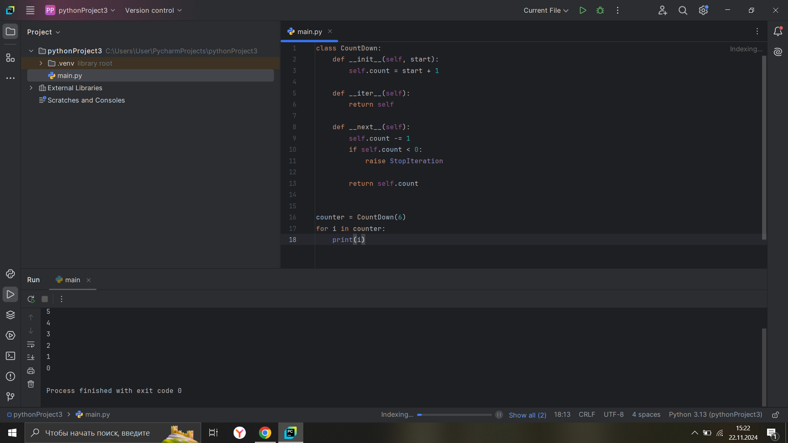
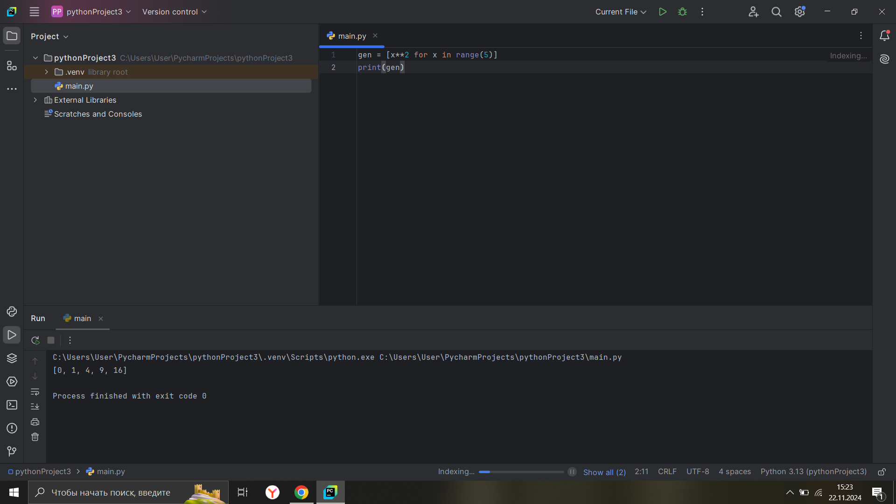
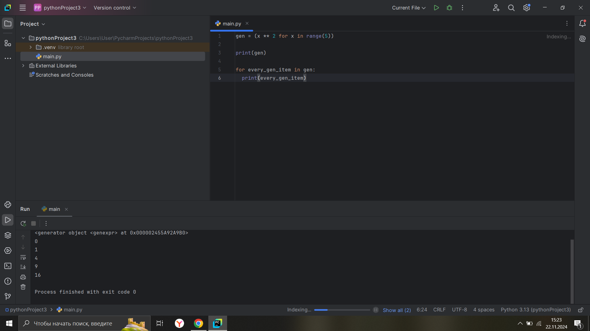
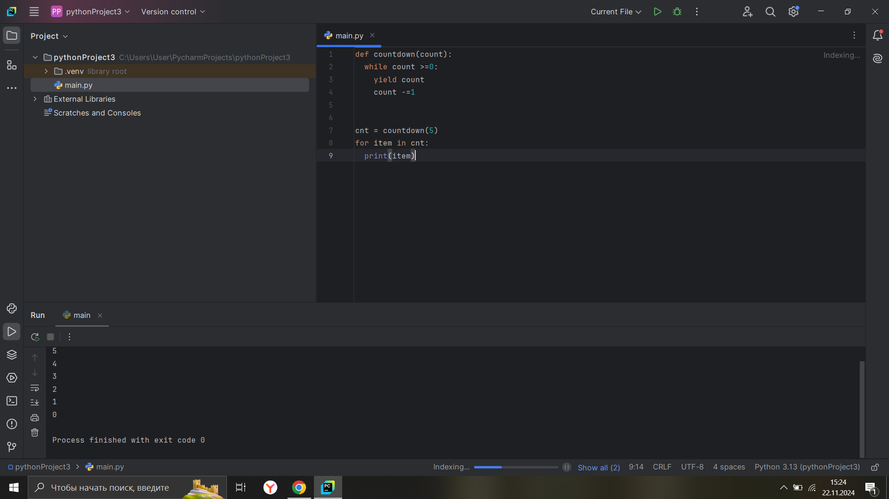
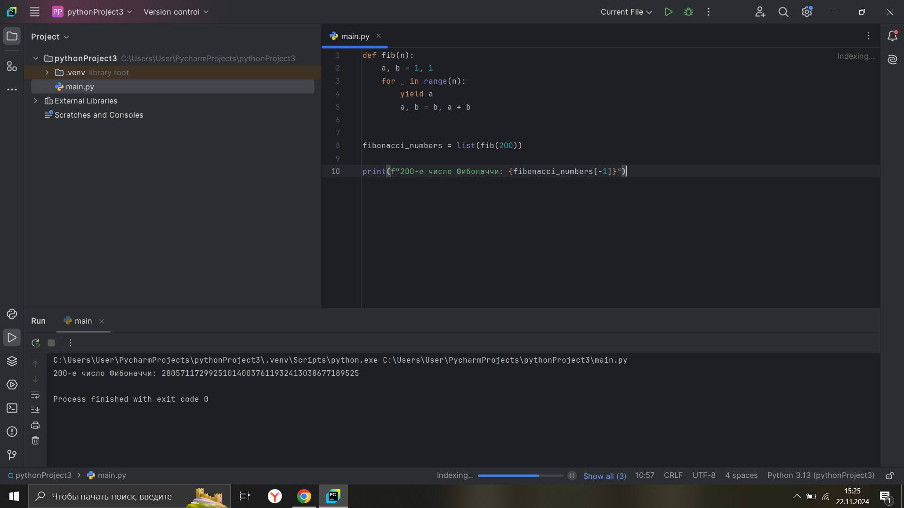
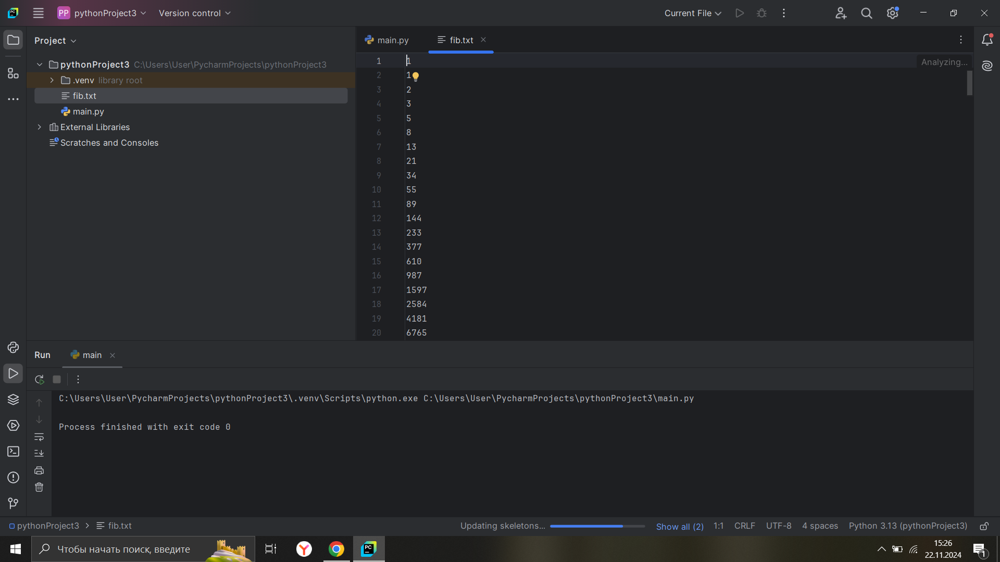

# Тема 11. Итераторы и генераторы
## Отчет по Теме #11 выполнил:
- Наговицын Дмитрий 
- АИС-22-1

| Задание | Лаб_раб | Сам_раб |
| ------ | ------ | ------ |
| Задание 1 | + | + |
| Задание 2 | + | + |
| Задание 3 | + |  |
| Задание 4 | + |  |
| Задание 5 | + |  |

знак "+" - задание выполнено; знак "-" - задание не выполнено;

Работу проверили:
- к.э.н., доцент Панов М.А.

## Лабораторная работа №1
### Простой итератор, но у него нет гибкой настройки, например его нельзя развернуть. Он работает просто как next(), но нет prev()

```python
numbers = [1, 2, 3, 4, 5]
for num in numbers:
  print(num)
```
### Результат.


## Лабораторная работа №2
### Класс итератор с гибкой настройкой и удобными применением

```python
class CountDown:
  def __init__(self, start):
    self.count = start + 1

  def __iter__(self):
    return self
  
  def __next__(self):
    self.count -= 1
    if self.count < 0:
      raise StopIteration
    
    return self.count
  
counter = CountDown(6)
for i in counter:
  print(i)
```
### Результат.



## Лабораторная работа №3
### Генератор списка

```python
gen = [x**2 for x in range(5)]
print(gen)
```
### Результат.



## Лабораторная работа №4
### Выражения генераторы

```python
gen = (x ** 2 for x in range(5))

print(gen)

for every_gen_item in gen:
  print(every_gen_item)
```
### Результат.




## Лабораторная работа №5
### Такой же счетчик, как и в первом задании, только это генератор и использует yield

```python
def countdown(count):
  while count >=0:
    yield count
    count -=1 


cnt = countdown(5)
for item in cnt:
  print(item)
```
### Результат.




## Самостоятельная работа 1
### Вас никак не могут оставить числа Фибоначчи, очень уж они вас заинтересовали. Изучив новые возможности Python вы решили реализовать программу, которая считает числа Фибоначчи при помощи итераторов. Расчет начинается с чисел 1 и 1. Создайте функцию fib(n), генерирующую n чисел Фибоначчи с минимальными затратами ресурсов. Для реализации этой функции потребуется обратиться к инструкции yield (Она не сохраняет в оперативной памяти огромную последовательность, а дает возможность “доставать” промежуточные результаты по одному). Результатом решения задачи будет листинг кода и вывод в консоль с числом Фибоначчи от 200

```python
def fib(n):
    a, b = 1, 1
    for _ in range(n):
        yield a
        a, b = b, a + b


fibonacci_numbers = list(fib(200))

print(f"200-е число Фибоначчи: {fibonacci_numbers[-1]}")
```

### Результат.



## Вывод

В ходе выполнения этого задания я узнал о команде yield, которая преобразует любую функцию Python в "генератор". Генераторы, в свою очередь, помогают снизить потребление оперативной памяти, так как они не хранят в себе всю последовательность (например, числа Фибоначчи) целиком, а извлекают промежуточные результаты по одному экземпляру, что действительно ускоряет выполнение кода.

## Самостоятельная работа 2
### К коду предыдущей задачи добавьте запоминание каждого числа Фибоначчи в файл “fib.txt”, при этом каждое число должно находиться на отдельной строчке. Результатом выполнения задачи будет листинг кода и скриншот получившегося файла
```python
def fib(n):
    a, b = 1, 1
    for _ in range(n):
        yield a
        a, b = b, a + b


with open('fib.txt', 'w') as f:
    fibonacci_numbers = fib(200)
    f.writelines(f"{num}\n" for num in fibonacci_numbers)
```

### Результат.



## Вывод

В данном задании я повторил способ заполнения текстового файла с помощью функции **writelines()**, вспомнил, что в python можно записывать переменную как `_`, а также попрактиковался в инструкции yield.

## Общие выводы по теме

В этой теме я познакомился с понятием "генераторы". Изучая документацию, я уже знал о методе List comprehension, который позволяет легко и удобно создавать списки. Однако у него есть существенный недостаток, связанный с потреблением оперативной памяти, что влияет на скорость выполнения задач. Эта тема помогла мне понять, как можно ускорить подобные процессы.
