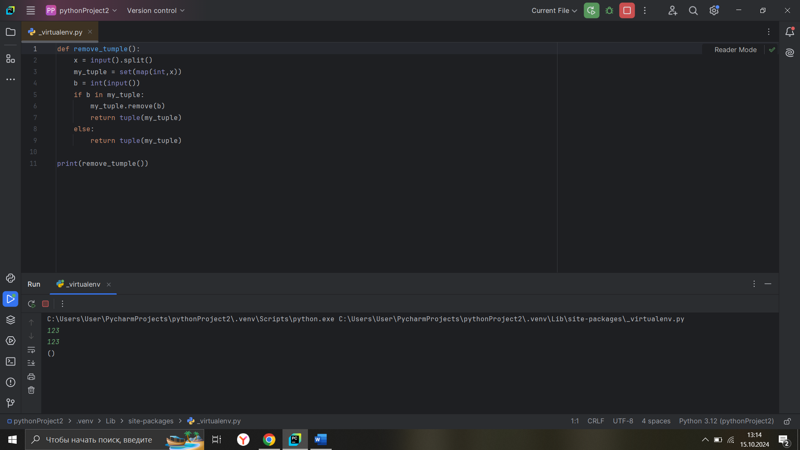

# Тема 7. Основы объектно-ориентированного программирования
Отчет по Теме #7 выполнил:
- Наговицын Дмитрий
- АИС-22-1

| Задание | Лаб_раб | Сам_раб |
| ------ | ------ | ------ |
| Задание 1 | + | + |
| Задание 2 | + | + |
| Задание 3 | + | + |
| Задание 4 | + | + |
| Задание 5 | + | + |


знак "+" - задание выполнено; знак "-" - задание не выполнено;

Работу проверили:
- к.э.н., доцент Панов М.А.

## Лабораторная работа №1
### 
```python
# Определяем класс Car
class Car:
    # Метод инициализации, который вызывается при создании нового экземпляра класса
    def __init__(self, make, model):
        # Инициализация атрибута 'make'
        self.make = make
        # Инициализация атрибута 'model' (модель автомобиля)
        self.model = model

# Создаем экземпляр класса Car с маркой "Toyota" и моделью "Corolla"
my_car = Car("Toyota", "Corolla")
```
### Результат.


## Лабораторная работа №2
### 

```python
# Определяем класс Car
class Car:
    # Метод инициализации, который вызывается при создании нового экземпляра класса
    def __init__(self, make, model):
        # Инициализация атрибута 'make'
        self.make = make
        # Инициализация атрибута 'model' (модель автомобиля)
        self.model = model

    # Метод drive, который выводит информацию о движении автомобиля
    def drive(self):
        print(f"Driving the {self.make} {self.model}")

# Создаем экземпляр класса Car с маркой "Toyota" и моделью "Corolla"
my_car = Car("Toyota", "Corolla")

# Вызываем метод drive для объекта my_car, чтобы вывести информацию о движении автомобиля
my_car.drive()
```
### Результат.


## Лабораторная работа №3
### 

```python
class Car:
    def __init__(self, make, model):
        self.make = make
        self.model = model

    def drive(self):
        print(f"Driving the {self.make} {self.model}")

my_car = Car("Toyota", "Corolla")

my_car.drive()

class ElectricCar(Car):
    # Метод инициализации, который расширяет родительский класс Car
    def __init__(self, make, model, battery_capacity):
        # Вызываем метод инициализации родительского класса Car
        super().__init__(make, model)
        self.battery_capacity = battery_capacity

    # Метод charge, который выводит информацию о зарядке автомобиля
    def charge(self):
        print(f"Charging the {self.make} {self.model} with {self.battery_capacity} kWh")

# Создаем экземпляр класса ElectricCar с маркой "Tesla", моделью "Model S" и емкостью батареи 75 кВтч
my_electric_car = ElectricCar("Tesla", "Model S", 75)
# Вызываем метод drive для объекта my_electric_car
my_electric_car.drive()
# Вызываем метод charge для объекта my_electric_car, чтобы вывести информацию о зарядке
my_electric_car.charge()
```
### Результат.


## Лабораторная работа №4
### 

```python
class Car:
    def __init__(self, make, model):
        self._make = make # защищенный атрибут
        self.__model = model # приватный атрибут

    def drive(self):
        print(f"Driving the {self._make} {self.__model}")

my_car = Car("Toyota", "Corolla")
print(my_car._make) # доступ к защищенному атрибуту
my_car.drive()
```
### Результат.


## Лабораторная работа №5
### 
```python
class Shape:
    def area(self):
        pass

class Rectangle(Shape):
    def __init__(self, width, height):
        self.width = width
        self.height = height

    def area(self):
        return self.width * self.height

class Circle(Shape):
    def __init__(self, radius):
        self.radius = radius

    def area(self):
        return 3.14 * self.radius * self.radius

# Создаем экземпляр класса Rectangle с шириной 10 и высотой 5
my_rectangle = Rectangle(10, 5)

# Выводим информацию о площади прямоугольника
print(f"The area of the rectangle is: {my_rectangle.area()}")

# Создаем экземпляр класса Circle с радиусом 7
my_circle = Circle(7)

# Выводим информацию о площади круга
print(f"The area of the circle is: {my_circle.area()}")
```
### Результат.


## Самостоятельная работа №1
###

```python

```
### Результат.


## Самостоятельная работа №2
###

```python

```
### Результат.


## Самостоятельная работа №3
###

```python

```
### Результат.


## Самостоятельная работа №4
###

```python

```
### Результат.


## Самостоятельная работа №5
###

```python

```
### Результат.

